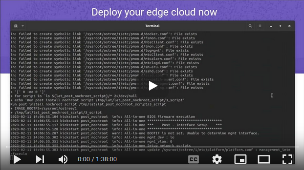
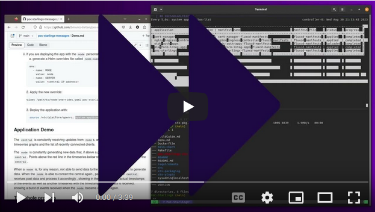

# Deploying your application to StarlingX

Deploying your own application to StarlingX is as easy as any other Kubernetes
deployment out there. In this blog post we'll show you the process with a
simple demonstration application.

It's important to understand that an application can be deployed in many ways
to the Kubernetes cluster(s) that StarlingX manages:

- [raw Kubernetes](https://kubernetes.io/docs/tutorials/kubernetes-basics/deploy-app/deploy-intro/);
- [Helm](https://helm.sh/docs/intro/using_helm/#helm-install-installing-a-package);
- [Flux](https://fluxcd.io/); and finally
- StarlingX Application, which benefits from tight integration with the
  [StarlingX system](https://opendev.org/starlingx/config).

> _NOTE_: TODO Saying that Helm is the most popular package manager needs a reference/link.

In this particular demonstration we will focus on [Helm](https://helm.sh/),
which is the most popular package manager for Kubernetes. Future blog posts
will address other deployment types and their advantages.

Any developer that already packages their application with
[Helm](https://helm.sh/) will be able to deploy their application in
StarlingX without any hassle.

## The Demo App

The application simulates a network of antivirus scanners and threat-monitoring
running independently and geographically distributed called `nodes`. When a node
detects threats above a configurable threshold in an area it reports to a
`central` instance responsible for aggregating, processing, and storing data
from all the `nodes` while presenting a bird's-eye view in a simple dashboard.

The application can act either as a `node` or a `central` (which are called
"personalities") depending on the environment variables it has available.

- `Nodes` are geographically spread out doing the actual work of monitoring, for
  example, local networks.
- `Central` is a deployment that receives messages from `nodes`, processing and
  presenting data related to them.

It's also possible to configure the threshold of a `node`, which determines
their sensitivity in the scanner for threats.

## Deploying the Demo App

### Via a Helm Package file

> _TODO_:  this is a WIP section. Similar to https://docs.starlingx.io/deploy_install_guides/release/kubernetes_access.html#id3

You can simply use the packaged Helm chart from your own source code, and
use the [Helm CLI](needs-reference) to install the package.

#### Package the Helm chart

```shell
git clone https://github.com/bmuniz-daitan/poc-starlingx-messages.git
cd poc-starlingx-messages
helm package helm-chart/
```

The above commands should create a `poc-starlingx-<version>.tgz` file.

```shell
...
Successfully packaged chart and saved it to: .../poc-starlingx-messages/poc-starlingx-1.5.2.tgz
```

#### Install the Helm package directly on StarlingX

Once you made the package available on a StarlingX instance, create an
overrides file (this all should be familiar if you already use Helm packaging)
. For the demonstration app that we're using, there are many options available
, but we'll stick to the simplest version of the overrides:

```shell
cat EOF >> poc-starlingx-messages.yml
env:
  - name: MODE
    value: central
EOF
```

Now proceed to installing the Helm package:

```shell
helm install poc-starlingx-messages -f poc-starlingx-message.yml
```

#### You're done!

You can see the resources deployed by Helm with the well-known `kubectl`
commands:

```shell
kubectl get pods -A
```

### Via a Helm Repository

> _NOTE_: TODO this is a WIP section

## Application Demo

> _TODO_: Should this section be included in the blog post?

[//]: # (TODO this whole text needs proofreading)

Below you see a `central` running on the right side of the screen and 4
`node`s running on the left side. `Node`s 1 and 2, on the top, are running with
a threshold of 5%, which means they are more sensitive, notifying the `central`
more frequently. `Node`s 3 and 4 at the bottom are running with a threshold of
20%.

The `central` (to the right) presents the following information:

- a time series of the processed events (based on the timestamp when the event
  was created on the `node`);
- a constantly updated list of recently connected `nodes`;
- a time series of received events (based on `central`'s timestamp when the event
  was received).

All 4 `node`s, to the left, are constantly generating new data. This random data
is generated using a long tail distribution and, if above a configured threshold
for the `node`, the data is sent to the `central`. Points above the red line in
the time series represent the data from each node that is sent to the `central`.


When a `node` is, for any reason, not able to send data to the `central`, it
continues to generate and accumulate data.

> _NOTE_: This offline status can be simulated with the click of a button in
this demonstration.


Notice how the number of reported events has gone down from around 12 to 2 and
the aggregated Threat Index went from around 11 to 8 during the time that
`node`s 1 and 2 were offline.

When the `node`s can reach the `central` again, accumulated data
is then sent to the `central`.


The `central` takes its time processing the recent burst of data and:

- updates its first graph to reflect the new data received by the `node`s;
- shows a spike of events received on the second graph.

## The whole process

Installing StarlingX (automated script):

[](https://www.youtube.com/watch?v=6z7EV17Emcw)

Deploying and demonstration:

[](https://youtu.be/IvBomQANXlo)
